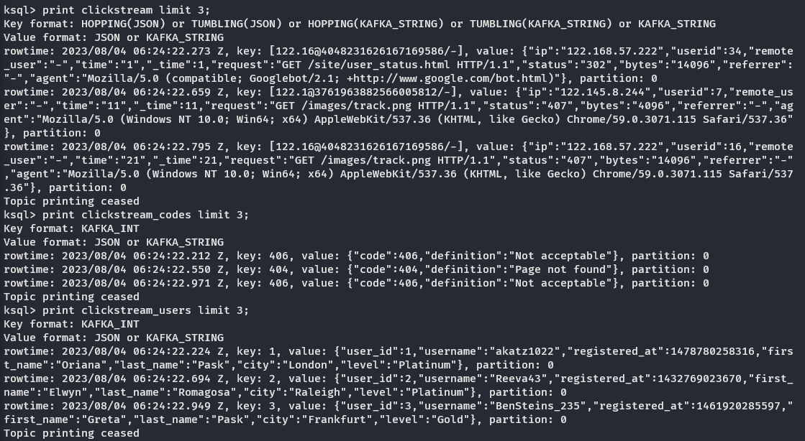

# Prerequisites

1. Docker and docker-compose
2. Bash-compatible environment such as WSL

# Executing the tutorial

Please follow [the guide](https://docs.confluent.io/platform/current/tutorials/examples/clickstream/docs/index.html) from Confluent portal. This README features screenshots for certain milestones of that guide.

## Startup step

You should see these 9 containers in Running state:

> ⚠ It's possible that some of the containers will fail to start because of their interdependencies. In this case, run `docker-compose up -d` one more time.

## Create the Clickstream Data step

You should be able to sample all 3 datagen connectors:

## Verify the data step

You can inspect the created stream and tables and their dependencies via Confluent Center UI, `ksqlDB` -> `clickstream` -> `Flow` tab:

## Load the Clickstream Data in Grafana step

After completing the tutorial, you should be able to see Grafana dashboard with 6 metrics:

# Metrics, detailed

## Users' IP addresses mapped to names and locations

## Sessionized user activity

## Enriched HTTP response codes statistics

## HTML pages requests per user

## All events per user per minute

## 400th HTTP errors per minute
